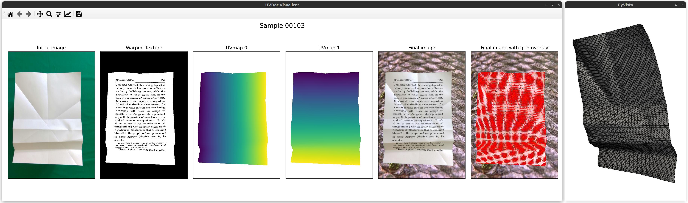

# UVDoc Dataset

This repository contains the UVDoc dataset, the code used to capture and annotate the dataset, and the code used to create the final images from the geometries, document textures, and backgrounds.

<p align="center">
  
</p>

## Download links

We release both the raw captures and annotations as well as the final dataset we used to train the model from the paper "Neural Document Unwarping using Coupled Grids".

### Final datasets

#### Final UVDoc dataset
The final dataset, with geometries, document textures and backgrounds applied, can be downloaded using the following link: [UVDoc_final.zip](https://igl.ethz.ch/projects/uvdoc/UVDoc_final.zip).
This is the dataset we used to train the model presented in the paper.

#### Final UVDoc benchmark dataset
The final benchmark dataset can be downloaded using the following link: [UVDoc_benchmark.zip](https://igl.ethz.ch/projects/uvdoc/UVDoc_benchmark.zip).

The folder for both final datasets are organized as follow:
```
UVDoc_final
├── grid2d/*.mat
├── grid3d/*.mat
├── img/*.png
├── img_geom/*.png
├── metadata_geom/*.json
├── metadata_sample/*.json
├── seg/*.mat
├── textures/*.png
├── uvmap/*.mat
├── warped_textures/*.png
├── wc/*.exr
└── split.json

```

### Raw UVDoc dataset
You can download the raw dataset at the following link: [UVDoc_raw.zip](https://igl.ethz.ch/projects/uvdoc/UVDoc_raw.zip).

The folder is organized as follows:

```
UVDoc_raw
├── backgrounds
│   ├── **/*.png
├── samples
│   ├── depth/*.mat
│   ├── grid2d/*.mat
│   ├── grid3d/*.mat
│   ├── rgb/*.png
│   ├── sample_metadata/*.json
│   ├── seg/*.mat
│   ├── uv/*.png
│   └── uvmap/*.mat
└── textures
    ├── *.png
    ├── **/*.png
    └── **/*.pdf

```

## Raw dataset capture

The capture process is detailed in the README of the `capture` folder.

## Final dataset creation

Once you have either downloaded the raw UVDoc dataset or captured your own dataset (and followed the instructions described in the README of the `capture` folder), you can create your own final dataset. This means combining the document textures, images of distorted white sheets of paper, and backgrounds.
You should have a folder containing your raw dataset with the same structure as the UVDoc raw dataset described above. You can add as many background and document textures as you want.

### Requirements

All requirements are listed in `requirements.txt`. You can install them using the following:
```
pip install -r requirements.txt
```

### Dataset creation

To create the final dataset, simply run the command:
```
python create_final.py --path [PATH] [--n-sample [N]] [--img-size [W H]] [--subprocess [S]] [--split] [--ratio [R]] [--no_color_transfer] [--benchmark_set]

--path                  Path to the raw dataset.
--n-sample              Number of samples to create (int).
--img-size              Width and height in pixels (2 int).
--subprocess            Number of subprocesses to use, to speed up the creation (int).
--split                 To create a validation set.
--ratio                 The ratio to use for dataset splitting (float between 0 and 1).
--no_color_transfer     Whether to use color transfer or not (default is with color transfer).
--benchmark_set         Whether to create a benchmark set (meaning tight cropping and no flip).
```

A `final` (or `final_train` and `final_val`) folder will be created containing the created samples. This command takes the images of white paper, the textures of documents, and the backgrounds and combines them.

### Dataset visualization

Once you have either downloaded the final dataset or created your own, you can visualize it using the `visualize.py` script in the following way:
```
python visualize.py --path [PATH] --sample [ID]

--path                  Path to the final dataset.
--sample                ID of the sample to visualize.
```

Two windows will appear, as presented below.

<p align="center">
  
</p>

### Statistics

The script `stats.py` allows the computation of the minimum and maximum coordinates along each axis of the 3D grid and of the world coordinates (wc) for the final dataset (can be used for data normalization). It can be used in the following way:
```
python stats_grid3d.py --path [PATH]

--path                  Path to the final dataset.
```

## Citation
If you used the UVDoc dataset, please consider citing our work:
```
@inproceedings{Verhoeven:UVDoc:2023,
  title={UVDoc: Neural Grid-based Document Unwarping},
  author={Floor Verhoeven and Tanguy Magne and Olga Sorkine-Hornung},
  booktitle = {Proc.\ SIGGRAPH Asia},
  year = {2023},
  url={https://doi.org/10.1145/3610548.3618174}
}
```

## References

The backgrounds used have been taken from the Describable Textures Dataset (DTD) [1].

For the training set, the document textures have been taken from various sources [2 - 51] or generated using DeepFloyd IF [52]. 
For the benchmark set, the document textures have been taken from several sources [53 - 58].


[1] Cimpoi, M., Maji, S., Kokkinos, I., Mohamed, S., & Vedaldi, A. (2014). Describing textures in the wild. In *Proceedings of the IEEE conference on computer vision and pattern recognition* (pp. 3606-3613).

[2] Chakravarthula, P., Tseng, E., Fuchs, H., & Heide, F. (2022). Hogel-free holography. *ACM Transactions on Graphics, 41*(5), 1-16.

[3] Paneva, V., Fleig, A., Plasencia, D. M., Faulwasser, T., & Müller, J. (2022). OptiTrap: Optimal trap trajectories for acoustic levitation displays. *ACM Transactions on Graphics, 41*(5), 1-14.

[4] Tursun, C., & Didyk, P. (2022). Perceptual Visibility Model for Temporal Contrast Changes in Periphery. *ACM Transactions on Graphics, 42*(2), 1-16.

[5] Ma, K., Gharbi, M., Adams, A., Kamil, S., Li, T. M., Barnes, C., & Ragan-Kelley, J. (2022). Searching for Fast Demosaicking Algorithms. *ACM Transactions on Graphics (TOG)*, 41(5), 1-18.

[6] Lin, S., Xiao, D., Shi, Z., & Wang, B. (2022). Surface Reconstruction from Point Clouds without Normals by Parametrizing the Gauss Formula. *ACM Transactions on Graphics, 42*(2), 1-19.

[7] Shi, L., Zhang, Y., Cheng, J., & Lu, H. (2021). Adasgn: Adapting joint number and model size for efficient skeleton-based action recognition. In *Proceedings of the IEEE/CVF International Conference on Computer Vision* (pp. 13413-13422).

[8] Huang, Q., Huang, X., Sun, B., Zhang, Z., Jiang, J., & Bajaj, C. (2021). Arapreg: An as-rigid-as possible regularization loss for learning deformable shape generators. In *Proceedings of the IEEE/CVF international conference on computer vision* (pp. 5815-5825).

[9] Li, L., Lei, J., Gan, Z., & Liu, J. (2021). Adversarial vqa: A new benchmark for evaluating the robustness of vqa models. In *Proceedings of the IEEE/CVF International Conference on Computer Vision* (pp. 2042-2051).

[10] Weng, C. Y., Curless, B., Srinivasan, P. P., Barron, J. T., & Kemelmacher-Shlizerman, I. (2022). Humannerf: Free-viewpoint rendering of moving people from monocular video. In *Proceedings of the IEEE/CVF Conference on Computer Vision and Pattern Recognition* (pp. 16210-16220).

[11] Xia, Z., Pan, X., Song, S., Li, L. E., & Huang, G. (2022). Vision transformer with deformable attention. In *Proceedings of the IEEE/CVF conference on computer vision and pattern recognition* (pp. 4794-4803).

[12] Wang, Q., Li, Z., Salesin, D., Snavely, N., Curless, B., & Kontkanen, J. (2022). 3D moments from near-duplicate photos. In *Proceedings of the IEEE/CVF Conference on Computer Vision and Pattern Recognition* (pp. 3906-3915).

[13] Wang, Y., Blei, D., & Cunningham, J. P. (2021). Posterior collapse and latent variable non-identifiability. *Advances in Neural Information Processing Systems, 34*, 5443-5455.

[14] Liu, R., Jia, C., Zhang, G., Zhuang, Z., Liu, T. X., & Vosoughi, S. (2022). Second Thoughts are Best: Learning to Re-Align With Human Values from Text Edits. *Advances in Neural Information Processing Systems*.

[15] Rangwani, H., Aithal, S. K., Mishra, M., & Babu, R. V. (2022). Escaping Saddle Points for Effective Generalization on Class-Imbalanced Data. *Advances in Neural Information Processing Systems*.

[16] Xiao, Q., Wu, B., Zhang, Y., Liu, S., Pechenizkiy, M., Mocanu, E., & Mocanu, D. C. (2022). Dynamic Sparse Network for Time Series Classification: Learning What to "see". *Advances in Neural Information Processing Systems*.

[17] Zhai, Y., Davenport, B., Schuetz, K., & Pappu, H. R. (2022). An on-site adaptable test for rapid and sensitive detection of Potato mop-top virus, a soil-borne virus of potato (Solanum tuberosum). *Plos one, 17(8)*, e0270918.

[18] Cernadas Curotto, P., Sander, D., d’Argembeau, A., & Klimecki, O. (2022). Back to the future: A way to increase prosocial behavior. *PloS one, 17(8)*, e0272340.

[19] Schote, A. B., Dietrich, K., Linden, A. E., Dzionsko, I., Molano Moreno, L. D. L. A., Winnikes, U., ... & Meyer, J. (2022). Real sweating in a virtual stress environment: Investigation of the stress reactivity in people with primary focal hyperhidrosis. *Plos one, 17(8)*, e0272247.

[20] Boni, I., Jara-Ettinger, J., Sackstein, S., & Piantadosi, S. T. (2022). Verbal counting and the timing of number acquisition in an indigenous Amazonian group. *Plos one, 17(8)*, e0270739.

[21] Sharif, N., Alzahrani, K. J., Ahmed, S. N., Khan, A., Banjer, H. J., Alzahrani, F. M., ... & Dey, S. K. (2022). Genomic surveillance, evolution and global transmission of SARS-CoV-2 during 2019–2022. *Plos one, 17(8)*, e0271074.

[22] *Beyond Penguins and Polar Bears*. (2014, May 20). Retrieved January 24, 2023, from https://beyondpenguins.ehe.osu.edu/

[23] Zheng, S., Zhou, Z., Chen, X., Yan, D., Zhang, C., Geng, Y., ... & Xu, K. (2022). LuisaRender: A High-Performance Rendering Framework with Layered and Unified Interfaces on Stream Architectures. *ACM Transactions on Graphics (TOG), 41*(6), 1-19.

[24] Pietroni, N., Dumery, C., Falque, R., Liu, M., Vidal-Calleja, T., & Sorkine-Hornung, O. (2022). Computational pattern making from 3D garment models. *ACM Transactions on Graphics (TOG), 41*(4), 1-14.

[25] Tian, Y., Xu, J., Li, Y., Luo, J., Sueda, S., Li, H., ... & Matusik, W. (2022). Assemble them all: Physics-based planning for generalizable assembly by disassembly. *ACM Transactions on Graphics (TOG), 41*(6), 1-11.

[26] Shao, H., Huang, L., & Michels, D. L. (2022). A fast unsmoothed aggregation algebraic multigrid framework for the large-scale simulation of incompressible flow. *ACM Transactions on Graphics (TOG), 41*(4), 1-18.

[27] Wei, X., Liu, M., Ling, Z., & Su, H. (2022). Approximate convex decomposition for 3d meshes with collision-aware concavity and tree search. *ACM Transactions on Graphics (TOG), 41*(4), 1-18.

[28] Xiang, D., Bagautdinov, T., Stuyck, T., Prada, F., Romero, J., Xu, W., ... & Wu, C. (2022). Dressing avatars: Deep photorealistic appearance for physically simulated clothing. *ACM Transactions on Graphics (TOG), 41*(6), 1-15.

[29] Hwang, I., Jeon, D. S., Munoz, A., Gutierrez, D., Tong, X., & Kim, M. H. (2022). Sparse ellipsometry: portable acquisition of polarimetric svbrdf and shape with unstructured flash photography. *ACM Transactions on Graphics (TOG), 41*(4), 1-14.

[30] Yu, Z., Zhang, C., Nowrouzezahrai, D., Dong, Z., & Zhao, S. (2022). Efficient Differentiation of Pixel Reconstruction Filters for Path-Space Differentiable Rendering. *ACM Transactions on Graphics (TOG), 41*(6), 1-16.

[31] Xiang, D., Prada, F., Bagautdinov, T., Xu, W., Dong, Y., Wen, H., ... & Wu, C. (2021). Modeling clothing as a separate layer for an animatable human avatar. *ACM Transactions on Graphics (TOG), 40*(6), 1-15.

[32] Wang, Y. C., Wu, Y. T., Li, T. M., & Chuang, Y. Y. (2021). Learning to cluster for rendering with many lights. *ACM Transactions on Graphics (TOG), 40*(6), 1-10.

[33] Zhang, X., Srinivasan, P. P., Deng, B., Debevec, P., Freeman, W. T., & Barron, J. T. (2021). Nerfactor: Neural factorization of shape and reflectance under an unknown illumination. *ACM Transactions on Graphics (ToG), 40*(6), 1-18.

[34] Li, G., Meka, A., Mueller, F., Buehler, M. C., Hilliges, O., & Beeler, T. (2022). EyeNeRF: a hybrid representation for photorealistic synthesis, animation and relighting of human eyes. *ACM Transactions on Graphics (TOG), 41*(4), 1-16.

[35] Morsy, M. M. A., Brunton, A., & Urban, P. (2022). Shape dithering for 3D printing. *ACM Transactions on Graphics (TOG), 41*(4), 1-12.

[36] Various (2007, March 10). *Chambers's Edinburgh Journal, No. 442 Volume 17, New Series, June 19, 1852*. Project Gutenberg. Retrieved May 5, 2023, from https://www.gutenberg.org/ebooks/20792

[37] Various (2007, March 7). *Punch, or the London Charivari, Volume 103, December 10, 1892*. Project Gutenberg. Retrieved May 5, 2023, from https://www.gutenberg.org/ebooks/20759

[38] Douglas, A. M. (2007, March 1). *A Little Girl in Old Salem*. Project Gutenberg. Retrieved May 5, 2023, from https://www.gutenberg.org/ebooks/20722

[39] Field, R. M. (2007, February 24). *The Romance of an Old Fool*. Project Gutenberg. Retrieved May 5, 2023, from https://www.gutenberg.org/ebooks/20661

[40] Anonymous (2007, March 1). *Little Cinderella*. Project Gutenberg. Retrieved May 5, 2023, from https://www.gutenberg.org/ebooks/20723

[41] About, E. (2007, March 2). *The Man With The Broken Ear*. Project Gutenberg. Retrieved May 5, 2023, from https://www.gutenberg.org/ebooks/20724

[42] Various (2004, November 22). *Dew Drops, Vol. 37, No. 07, February 15, 1914*. Project Gutenberg. Retrieved May 5, 2023, from https://www.gutenberg.org/ebooks/14116

[43] Froude, J. A. (2007, March 6). *Short Studies on Great Subjects*. Project Gutenberg. Retrieved May 5, 2023, from https://www.gutenberg.org/ebooks/20755

[44] Kettle, T. (2012, February 16). *Poems & Parodies*. Project Gutenberg. Retrieved May 5, 2023, from https://www.gutenberg.org/ebooks/38898

[45] Zweig, S. (2012, April 9). *Jeremiah: A Drama in Nine Scenes*. Project Gutenberg. Retrieved May 5, 2023, from https://www.gutenberg.org/ebooks/39402

[46] Yonge, C. M. (2008, August 30). *Little Lucy's Wonderful Globe*. Project Gutenberg. Retrieved May 5, 2023, from https://www.gutenberg.org/ebooks/26487

[47] White, R. A. (2008, August 8). *Sunny Boy in the Country*. Project Gutenberg. Retrieved May 5, 2023, from https://www.gutenberg.org/ebooks/26232

[48] Yezierska, A. (2012, October 30). *Hungry Hearts*. Project Gutenberg. Retrieved May 5, 2023, from https://www.gutenberg.org/ebooks/41232

[49] Wodehouse, P. G. (2007, March 1). *The Girl on the Boat*. Project Gutenberg. Retrieved May 5, 2023, from https://www.gutenberg.org/ebooks/20717

[50] Quincy, A. (2011, April 11). *The Outdoor Chums on a Houseboat; Or, The Rivals of the Mississippi*. Project Gutenberg. Retrieved May 5, 2023, from https://www.gutenberg.org/ebooks/35831

[51] Bangs, J. K. (2007, March 7). *The Autobiography of Methuselah*. Project Gutenberg. Retrieved May 5, 2023, from https://www.gutenberg.org/ebooks/20766

[52] DeepFloyd (2023, April 29). IF. GitHub. Retrieved May 5, 2023, from https://github.com/deep-floyd/IF

[53] Richardson, E., & Weiss, Y. (2018). On gans and gmms. *Advances in neural information processing systems, 31*.

[54] Gu, T., Chen, G., Li, J., Lin, C., Rao, Y., Zhou, J., & Lu, J. (2022). Stochastic trajectory prediction via motion indeterminacy diffusion. In *Proceedings of the IEEE/CVF Conference on Computer Vision and Pattern Recognition* (pp. 17113-17122).

[55] Berkeley, G. (2012, May 20). *The Works of George Berkeley. Vol. 1 of 4: Philosophical Works, 1705-21*. Project Gutenberg. Retrieved May 5, 2023, from https://www.gutenberg.org/ebooks/39746

[56] Friedl, H., & Luhr, O. (2009, July 11). *Manufacturing Cost Data on Artificial Ice*. Project Gutenberg. Retrieved May 5, 2023, from https://www.gutenberg.org/ebooks/29375

[57] (n.d.). *Issue 1.2 — Use cases and affordances*. Libre Graphics Magazine. Retrieved May 5, 2023, from https://archive.libregraphicsmag.com/1.2/

[58] (n.d.). Issue 2.2 — Gendering F/LOSS. Libre Graphics Magazine. Retrieved May 5, 2023, from https://archive.libregraphicsmag.com/1.2/
