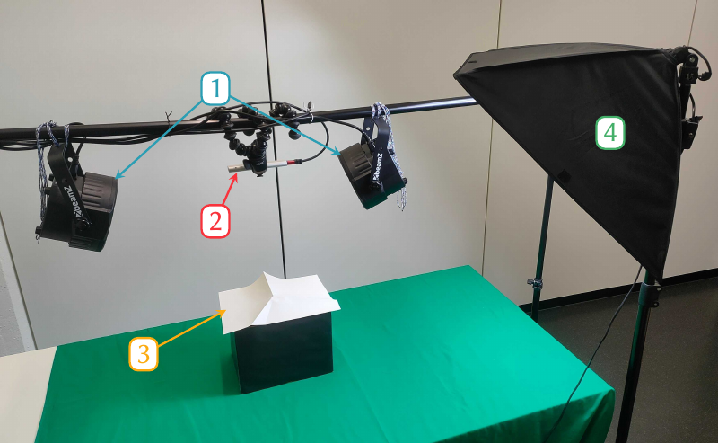
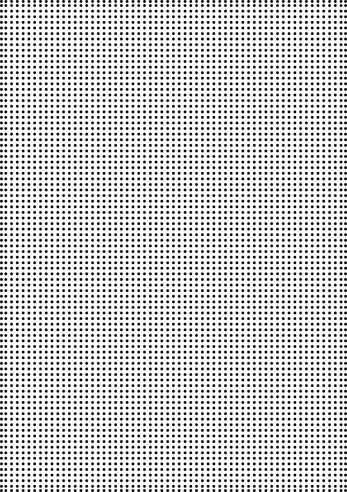
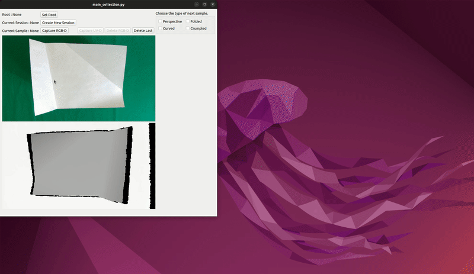
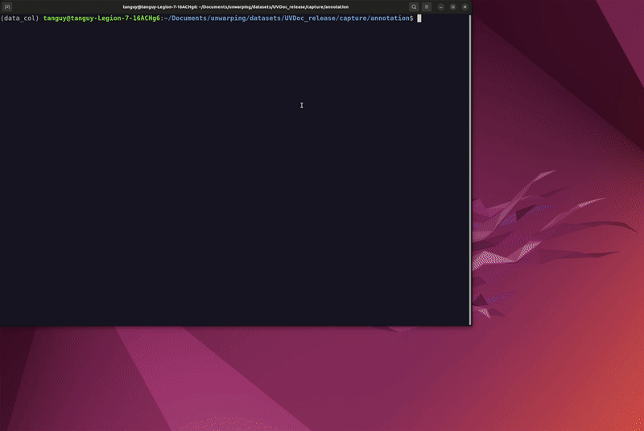

# UVDoc Dataset - Capture

This folder contains all the code required to capture and annotate the UVDoc dataset.
It can be used to create a new dataset, to extend the current UVDoc dataset, or reannotate it.

## Physical Setup

<p align="center">
  
</p>

The physical setup is composed of UV lights [1], one or several depth cameras (Intel RealSense D435 or SR305) [2], a distorted piece of paper with a grid of dots printed using UV ink [3], and regular lights [4], as can be seen in the picture above.

The grid of dots we used can be found in `img/grid.png`. It looks like this. You can adapt the color to the UV ink you are using to make sure the grid is well visible under UV light.

<p align="center">
  
</p>

## Requirements

Once the setup is in place, you'll need to clone this repo and create a new environements with all packages listed in `requirements.txt`.

> Note : The camera used are Intel RealSense cameras. To work with those, you'll need to have the Intel RealSense SDK 2.0 installed. See [here](https://github.com/IntelRealSense/librealsense/tree/development) for informations on how to install it.

## Capture

In `collection/realsense_capture.py`, add to `SERIAL_NUMBERS` the serial number of your cameras.

Simply run `python collection/main_collection.py`. You then need to specify where you want to store your data, create a new session and start capturing some data, as described in the GIF below.

<p align="center">
  
</p>

## Annotation

Once the capture is completed, you can start annotating your data. For that, you simply need to run the following:
```shell
python annotation/main_annotation.py --path [PATH]

--path                  Path to the session of capture to annotate.
```
And then proceed as shown in the GIF below.

<p align="center">
  
</p>

Then to finalize the annotation, one needs to create the 3D mesh grid and the UV maps. For that, run the following commands:
```shell
python compute_grid3d.py --path [PATH]
python compute_uvmap.py --path [PATH]

--path                  Path to a session of capture.
```

## Cleaning

Finally, once everything is completed, you might end up with several folders because you capture samples across multiple sessions and cameras. Also, some of your captured samples might not be annotated. To clean everything, run: 
```
python clean_raw.py --path [PATH]

--path                  Path to the folder containing all sessions.
```

You should be left with a folder with the following structure:
```
raw
└── samples
    ├── depth/*.mat
    ├── grid2d/*.mat
    ├── grid3d/*.mat
    ├── rgb/*.png
    ├── sample_metadata/*.json
    ├── seg/*.mat
    ├── uv/*.png
    └── uvmap/*.mat
```

You can create two folders, `backgrounds` and `textures`, and add the backgrounds and textures you want to use with your captured samples.